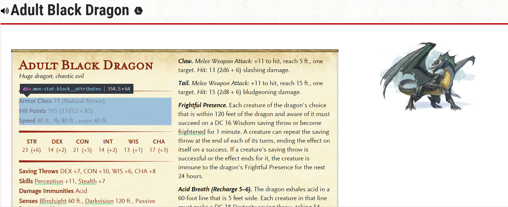

I love Dungeons & Dragons. I'm also a data-loving Data Scientist. These two worlds were inevitably bound to collide .

For those who have never heard of the game, Dungeons and Dragons (D&D) is a fantasy tabletop role-playing game that was first published in 1974, and has a tremendous amount of data associated with the game. Essentially, the characters band together to form a party and undertake adventures, ranging from finding a villager's missing prize-winning piglet to stopping the revival of an ancient Great Old One from the [Far Realm](https://forgottenrealms.fandom.com/wiki/Far_Realm) that will bring about unspeakable horrors on the land. A Dungeon Master serves as the game's referee and storyteller, creating and maintaining the very world in which the adventures occur.

The large amounts of data is associated with the world-building aspect of the game, and is released by the official creators and players alike. This content shapes the encounters the players face throughout the campaign, including the monsters and enemies that inhabit the world created by the Dungeon Master.

In addition to the plethora of official books available for players, there is a fantastic site for D&D content called [DND Beyond](https://www.dndbeyond.com/) that catalogues information on characters, monsters, treasures, and spells. Unfortunately, there is no API available, but it is apparently [in the works](https://twitter.com/dndbeyond/status/909834529736740864?lang=en). I thought it would be a great exercise to master web scraping in R by playing around with the data on monster statistics from one of my favourite pastimes.


# Table of Contents

1. [Structure of the scraping task](#step0)
2. [Scrape individual monster page URLS](#step1)
3. [Using `RSelenium` to access pages behind login](#step2)
4. [Write a function to scrape each individual pages](#step3)
5. [Putting it all together](#monster-example)


# Structure of the scraping task <a name="step0"></a>
If you visit https://www.dndbeyond.com/monsters, you'll see the first of many pages of monster listings. Each monster name is a link to the individual monster page that contains extensive details about the monster's statistics, abilities, and lore.

Some of the monsters, such as the [Adult Black Dragon](https://www.dndbeyond.com/monsters/adult-black-dragon) are free to view. Other monsters are not included in the Basic Rules Set and can only viewed if you have purchased the digital books associated with the monster.

### Required Packages
```
    library(RSelenium)
    library(rvest)
    library(tidyverse)
    library(knitr)
    library(kableExtra)
```

# Scrape individual monster page URLs <a name="step1"></a>
The URLs for the pages worth of monsters seem to follow a consistent format: `https://www.dndbeyond.com/monsters?page=NUM` where `NUM` ranges from 1 to the last page. We first need to get the total number of pages by locating the last page.
```
    monsters <- read_html("https://www.dndbeyond.com/monsters")
    num_pages <- monsters %>%
      html_nodes(".b-pagination-item") %>%
      html_text() %>%
      as.integer() %>%
      max(na.rm = TRUE)
```

Details tutorials for the [`rvest`](https://cran.r-project.org/web/packages/rvest/rvest.pdf) can be found [here](https://blog.rstudio.com/2014/11/24/rvest-easy-web-scraping-with-r/).

### Extract URLs
Now that we know there are 53 pages worth of monsters (`num_pages`), we can write a function that loops through and extracts the individual monster URLs on each page
```
    get_monster_url <- function(url) {
      page <- read_html(url)
      abs_links <- page %>%
        html_nodes(".link") %>%
        html_attr("href") %>%
        str_subset("/monsters/") %>%
        str_replace_all("/monsters/", "https://www.dndbeyond.com/monsters/")
    }
```

The `get_monster_links` function takes the URL of a page of results as an input (such as https://www.dndbeyond.com/monsters?page=2). Now we can loop through all the pages of results to get the hundreds of pages of individual monsters.
```
    all_monster_urls <- lapply(seq_len(num_pages), function(i) {
      url = paste0("https://www.dndbeyond.com/monsters?page=", i)
      get_monster_url(url)
    }) %>% unlist
```
# Using `RSelenium` to access pages behind login <a name="step2"></a>

Now that we looped through pages of tables to get the individual monster URLs, we are almost ready to scrape the details. Unfortunately, most of the monster pages can only be viewed if you are logged on and have paid for the corresponding digital books. DND Beyond uses Twitch for authentication which involves a redirect. Luckily, we can use the `RSelenium` package to automate web browsing.

We can start an automatic browsing session using the following:
```
    rD <- rsDriver(browser = "chrome")
    remdr <- rD[['client']]
```
Now we can start navigating the browser.
```
    url <- "https://www.dndbeyond.com/login"
    remdr$navigate(url)
    remdr$findElement(using = "css selector", value = ".twitch-button")$clickElement()
    # Uncomment below and replace USERNAME/PASSWORD to automatically login
      # remdr$findElement(using = "css selector", value = ".text")$sendKeysToElement(list("USERNAME", key = "tab", "PASSWORD", "\uE007"))
    Sys.sleep(1)
    remdr$findElement(using = 'css selector', value = '.js-authorize-text')$clickElement()
```
Aaand we're in! Now that we have access to our digital books and associated monsters, we can start to scrape all the juicy details.

# Write a function to scrape each individual pages <a name="step3"></a>


<details>
  <summary> <b>Click here for complete `scrape_monster_page` function</b> </summary>

    scrape_monster_page <- function(page){

      # Overview
      monster_name <- select_text(page, ".mon-stat-block__name-link")
      monster_portrait <- page %>% html_node('.detail-content') %>% html_node('img') %>% html_attr('src')
      meta_text <- select_text(page, ".mon-stat-block__meta")
      meta_split1 <- str_split(meta_text, ", ")[[1]]
      meta_split2 <- str_split(meta_split1, " ")[[1]]
      monster_size <- tools::toTitleCase(meta_split2[1])
      monster_type <- tools::toTitleCase(meta_split2[2])
      monster_alignment <- tools::toTitleCase(meta_split1[2])
      monster_overview <- tibble(Label = c('Name', "Size", "Type", "Alignment"),
                                 Content = c(monster_name, monster_size, monster_type, monster_alignment))

      # Monster Attributes
      monster_attributes_node <- page %>% html_nodes('.mon-stat-block__attribute')
      monster_attributes <- do.call(rbind, lapply(monster_attributes_node, function(node) {
        attribute_label <- node %>% select_text(".mon-stat-block__attribute-label")
        attribute_value <- node %>% select_text(".mon-stat-block__attribute-data-value")
        attribute_extra <- node %>% select_text(".mon-stat-block__attribute-data-extra") %>% replace_if_empty("")
        attribute_content <- paste(attribute_value, attribute_extra)
        tibble(Label = attribute_label, Content = attribute_content)
      }))

      # Ability Score
      ability_score_node <- page %>% html_nodes(".ability-block__stat")
      monster_ability_scores <- do.call(rbind, lapply(ability_score_node, function(node) {
        ability <- node %>% select_text(".ability-block__heading")
        score <- node %>% select_text('.ability-block__score') %>% as.integer()
        modifier <- node %>% select_text('.ability-block__modifier')
        score_content <- paste(score, modifier)
        tibble(Label = ability, Content = score_content)
      }))

      #Tidbits
      tidbits_node <- page %>% html_nodes('.mon-stat-block__tidbits')
      tidbits <- do.call(rbind, lapply(tidbits_node, function(node) {
        label <- node %>% select_text(".mon-stat-block__tidbit-label")
        value <- node %>% select_text(".mon-stat-block__tidbit-data")
        tibble(Label = label, Content = value)
      }))

      #Description
      description_node <- page %>% html_nodes('.mon-stat-block__description-block')
      description_sections <- do.call(rbind, lapply(description_node, function(node) {
        header <- node %>% select_text(".mon-stat-block__description-block-heading") %>% replace_if_empty("Misc Features")
        content <- node %>% select_text(".mon-stat-block__description-block-content p")
        tibble(Label = header, Content = content)
      }))

      # Extra Info
      extra_info <- page %>% select_text(".mon-details__description-block-content")

      # Extended Info

      extended_info <- tibble(Label = c("Tags", "Environment", "Source"),
                              Content = c(page %>% select_text(".monster-tag") %>% paste(collapse = ",") %>% replace_if_empty("Unknown"),
                                          page %>% select_text(".environment-tag") %>% paste(collapse = ",") %>% replace_if_empty("Unknown"),
                                          page %>% select_text(".monster-source") %>% paste(collapse = ",") %>% replace_if_empty("Unknown")))

      tibble(Portrait = monster_portrait,
             Name =   monster_name,
             Overview = list(monster_overview),
             Attributes = list(monster_attributes),
             Ability_Scores = list(monster_ability_scores),
             Tidbits = list(tidbits),
             Description= list(description_sections),
             Extra_Info = (extra_info),
             Extended_info = list(extended_info))
    }

</details>

<br>

The main goal of this project is to write the `scrape_monster_page` function to scrape the data from each individual monster page. Click the dropdown link above for the full code or view it on Github. There are three main principles to pay attention to when writing a similar function.

### Principle 1: Utilize the page source

If we wanted to pull the values for the Armor Class, Hit Points, and Speed, we can inspect the page source and find that specific block.


```
    <div class="mon-stat-block__attributes">
            <div class="mon-stat-block__attribute">
                <span class="mon-stat-block__attribute-label">Armor Class</span>
                <span class="mon-stat-block__attribute-value">
                    <span class="mon-stat-block__attribute-data-value">
                        19
                    </span>

                        <span class="mon-stat-block__attribute-data-extra">
                            (Natural Armor)  
                        </span>

                </span>
            </div>
            <div class="mon-stat-block__attribute">
                <span class="mon-stat-block__attribute-label">Hit Points</span>
                <span class="mon-stat-block__attribute-data">
                    <span class="mon-stat-block__attribute-data-value">
                        195
                    </span>
                    <span class="mon-stat-block__attribute-data-extra">
                        (17d12 + 85)
                    </span>      
                </span>
            </div>
            <div class="mon-stat-block__attribute">
                <span class="mon-stat-block__attribute-label">Speed</span>
                <span class="mon-stat-block__attribute-data">
                    <span class="mon-stat-block__attribute-data-value">
                        40 ft., fly 80 ft., swim 40 ft.

                    </span>
                </span>
            </div>
        </div>
```
With the `.mon-stat-block__attributes` class selected, we can see that each line is subdivided by spans with the classes `mon-stat-block__attribute-label`, `mon-stat-block__attribute-data`, and sometimes `mon-stat-block__attribute-data-extra`. However, it is not as simple as scraping the each `attribute` class and we'll see why below.

### Principle 2: Print Often
Using the above example of the Armor Class, Hit Points, and Speed, if we arbitrarily select the `attribute` class for each attribute, this is what we get:
```
    page %>% html_nodes(".mon-stat-block__attribute") %>% html_text()
    [1] "\n            Armor Class\n            \n                \n                    19\n                \n                \n                    \n                        (Natural Armor)  \n                     \n                         \n            \n        "
    [2] "\n            Hit Points\n            \n                \n                    195\n                \n                \n                    (17d12 + 85)\n                      \n            \n        "                                                         
    [3] "\n            Speed\n            \n                \n                    40 ft., fly 80 ft., swim 40 ft.\n                     \n                \n            \n        "                                                                                       
```
While the character vector does contain all the information, it is very messy. Instead, we should access the three `mon-stat-block__attribute` sections separately and `rbind` them together.
```
    page %>% html_nodes(".mon-stat-block__attribute-label") %>% html_text()
    [1] "Armor Class" "Hit Points"  "Speed"      
    page %>% html_nodes(".mon-stat-block__attribute-data-value") %>% html_text() %>% trimws()
    [1] "19"                              "195"                             "40 ft., fly 80 ft., swim 40 ft."
    page %>% html_nodes(".mon-stat-block__attribute-data-extra") %>% html_text() %>% trimws()
    [1] "(Natural Armor)" "(17d12 + 85)"
```
As we noted before, the `mon-stat-block__attribute-data-extra` class is not present for every attribute (`Speed` does not have an extra value in this case).

### Principle 3: Loops, loops, and more loops

The end result we want looks like this:
```
    monster_attributes
    # A tibble: 3 x 2
      Label       Content                          
      <chr>       <chr>                             
    1 Armor Class 19 (Natural Armor)                
    2 Hit Points  195 (17d12 + 85)                  
    3 Speed       "40 ft., fly 80 ft., swim 40 ft. "
```
First, we need to define some helper functions to avoid redundancies.

* `select_text` to minimize the repetitive `page %>% html_nodes %>% html_text`
```
    select_text <- function(xml, selector, trim = TRUE) {
      text <- xml %>%
        html_nodes(selector) %>%
        html_text %>% trimws()
      text
    }
```

* `replace_if_empty` to replace empty text with a string of choice
```
      replace_if_empty <- function(text, replacement) {
        if (length(text)==0) {text <- replacement}
        else if (text == "") {text <- replacement}
        text
      }
```


Now we can run the loop shown below to generate the tidy `monster_attributes` table:
```
    # Monster Attributes: Armor Class, HP, and Speed
      monster_attributes_node <- page %>% html_nodes('.mon-stat-block__attribute')
      monster_attributes <- do.call(rbind, lapply(monster_attributes_node, function(node) {
        attribute_label <- node %>% select_text(".mon-stat-block__attribute-label")
        attribute_value <- node %>% select_text(".mon-stat-block__attribute-data-value")
        attribute_extra <- node %>% select_text(".mon-stat-block__attribute-data-extra") %>% replace_if_empty("")
        attribute_content <- paste(attribute_value, attribute_extra)
        tibble(Label = attribute_label, Content = attribute_content)
      }))
```
* Note that the `mon-stat-block__attribute-data-value` and `mon-stat-block__attribute-data-extra` are merged into one column (`Content`).

Nearly all of the code on the `scrape_monster_page` function is a repeat of the aforementioned principles, and can be used for the majority of scraping tasks that use rvest.

# Putting it all together <a name="monster-example"></a>

Add a little [`knitr::kable & kableExtra`](https://cran.r-project.org/web/packages/kableExtra/vignettes/awesome_table_in_html.html) magic for HTML tables and viola!

<details>
  <summary> <b>Click here for the complete `find_monster` function to search for a monster by name and output an HTML Table</b> </summary>


    tibble_length <- function(tibs) {
      (monster_table %>% .[[tibs]] %>% unlist %>% length)/2
    }

    find_monster <- function(monster){
      monster_table <- monster_info %>% filter(Name == monster)
      monster_portrait <- monster_table$Portrait
      portrait_row <- tibble("Label" = " ", "Content" = sprintf(")", monster_portrait))
      monster_data <- unlist(monster_table[,c(3:6,9,7)], recursive = FALSE)
      monster_data <- do.call("rbind", monster_data)
      monster_data <- rbind(portrait_row, monster_data[2:nrow(monster_data),])

      monster_summary <- kable(monster_data, row.names = F, booktabs=T, col.names=c("", "")) %>%
        kable_styling("striped") %>%
        group_rows(monster_table$Name, 1, 4) %>%
        group_rows(index = c(" " = 4,
                           "Attributes" = tibble_length("Attributes"),
                           "Ability Score" = tibble_length("Ability_Scores"),
                           "Tidbits" = tibble_length("Tidbits"),
                           "Tags" = tibble_length("Extended_info"),
                           "Description" = tibble_length('Description')))

      description <- monster_table[[8]] %>%
        str_split("\n") %>%
        simplify() %>%
        str_replace("Lair Actions", "<b>Lair Actions</b>") %>%
        str_replace("Regional Effects", "<b>Regional Effects</b>") %>%
        kable(col.names=c("Description"), escape = F, booktabs = T, format="html") %>%
        kable_styling('striped', full_width = F)

      print(monster_summary)
      print(description)

    }

</details>

<br>

```
find_monster("Adult Black Dragon")
```


<table class="table table-striped" style="margin-left: auto; margin-right: auto;">
<tbody>
  <tr grouplength="4"><td colspan="2" style="border-bottom: 1px solid;"><strong>Adult Black Dragon</strong></td></tr>
<tr>
   <td style="text-align:left; padding-left: 2em;" indentlevel="1">  </td>
   <td style="text-align:left;">  </td>
  </tr>
  <tr>
   <td style="text-align:left; padding-left: 2em;" indentlevel="1"> Size </td>
   <td style="text-align:left;"> Huge </td>
  </tr>
  <tr>
   <td style="text-align:left; padding-left: 2em;" indentlevel="1"> Type </td>
   <td style="text-align:left;"> Dragon </td>
  </tr>
  <tr>
   <td style="text-align:left; padding-left: 2em;" indentlevel="1"> Alignment </td>
   <td style="text-align:left;"> Chaotic Evil </td>
  </tr>
  <tr grouplength="3"><td colspan="2" style="border-bottom: 1px solid;"><strong>Attributes</strong></td></tr>
<tr>
   <td style="text-align:left; padding-left: 2em;" indentlevel="1"> Armor Class </td>
   <td style="text-align:left;"> 19 (Natural Armor) </td>
  </tr>
  <tr>
   <td style="text-align:left; padding-left: 2em;" indentlevel="1"> Hit Points </td>
   <td style="text-align:left;"> 195 (17d12 + 85) </td>
  </tr>
  <tr>
   <td style="text-align:left; padding-left: 2em;" indentlevel="1"> Speed </td>
   <td style="text-align:left;"> 40 ft., fly 80 ft., swim 40 ft. </td>
  </tr>
  <tr grouplength="6"><td colspan="2" style="border-bottom: 1px solid;"><strong>Ability Score</strong></td></tr>
<tr>
   <td style="text-align:left; padding-left: 2em;" indentlevel="1"> STR </td>
   <td style="text-align:left;"> 23 (+6) </td>
  </tr>
  <tr>
   <td style="text-align:left; padding-left: 2em;" indentlevel="1"> DEX </td>
   <td style="text-align:left;"> 14 (+2) </td>
  </tr>
  <tr>
   <td style="text-align:left; padding-left: 2em;" indentlevel="1"> CON </td>
   <td style="text-align:left;"> 21 (+5) </td>
  </tr>
  <tr>
   <td style="text-align:left; padding-left: 2em;" indentlevel="1"> INT </td>
   <td style="text-align:left;"> 14 (+2) </td>
  </tr>
  <tr>
   <td style="text-align:left; padding-left: 2em;" indentlevel="1"> WIS </td>
   <td style="text-align:left;"> 13 (+1) </td>
  </tr>
  <tr>
   <td style="text-align:left; padding-left: 2em;" indentlevel="1"> CHA </td>
   <td style="text-align:left;"> 17 (+3) </td>
  </tr>
  <tr grouplength="6"><td colspan="2" style="border-bottom: 1px solid;"><strong>Tidbits</strong></td></tr>
<tr>
   <td style="text-align:left; padding-left: 2em;" indentlevel="1"> Saving Throws </td>
   <td style="text-align:left;"> DEX +7, CON +10, WIS +6, CHA +8 </td>
  </tr>
  <tr>
   <td style="text-align:left; padding-left: 2em;" indentlevel="1"> Skills </td>
   <td style="text-align:left;"> Perception +11, Stealth +7 </td>
  </tr>
  <tr>
   <td style="text-align:left; padding-left: 2em;" indentlevel="1"> Damage Immunities </td>
   <td style="text-align:left;"> Acid </td>
  </tr>
  <tr>
   <td style="text-align:left; padding-left: 2em;" indentlevel="1"> Senses </td>
   <td style="text-align:left;"> Blindsight 60 ft., Darkvision 120 ft.,  Passive Perception 21 </td>
  </tr>
  <tr>
   <td style="text-align:left; padding-left: 2em;" indentlevel="1"> Languages </td>
   <td style="text-align:left;"> Common, Draconic </td>
  </tr>
  <tr>
   <td style="text-align:left; padding-left: 2em;" indentlevel="1"> Challenge </td>
   <td style="text-align:left;"> 14 (11,500 XP) </td>
  </tr>
  <tr grouplength="3"><td colspan="2" style="border-bottom: 1px solid;"><strong>Tags</strong></td></tr>
<tr>
   <td style="text-align:left; padding-left: 2em;" indentlevel="1"> Tags </td>
   <td style="text-align:left;"> Unknown </td>
  </tr>
  <tr>
   <td style="text-align:left; padding-left: 2em;" indentlevel="1"> Environment </td>
   <td style="text-align:left;"> Swamp </td>
  </tr>
  <tr>
   <td style="text-align:left; padding-left: 2em;" indentlevel="1"> Source </td>
   <td style="text-align:left;"> Basic Rules </td>
  </tr>
  <tr grouplength="12"><td colspan="2" style="border-bottom: 1px solid;"><strong>Description</strong></td></tr>
<tr>
   <td style="text-align:left; padding-left: 2em;" indentlevel="1"> Misc Features </td>
   <td style="text-align:left;"> Amphibious. The dragon can breathe air and water. </td>
  </tr>
  <tr>
   <td style="text-align:left; padding-left: 2em;" indentlevel="1"> Misc Features </td>
   <td style="text-align:left;"> Legendary Resistance (3/Day). If the dragon fails a saving throw, it can choose to succeed instead. </td>
  </tr>
  <tr>
   <td style="text-align:left; padding-left: 2em;" indentlevel="1"> Actions </td>
   <td style="text-align:left;"> Multiattack. The dragon can use its Frightful Presence. It then makes three attacks: one with its bite and two with its claws. </td>
  </tr>
  <tr>
   <td style="text-align:left; padding-left: 2em;" indentlevel="1"> Actions </td>
   <td style="text-align:left;"> Bite. Melee Weapon Attack: +11 to hit, reach 10 ft., one target. Hit: 17 (2d10 + 6) piercing damage plus 4 (1d8) acid damage. </td>
  </tr>
  <tr>
   <td style="text-align:left; padding-left: 2em;" indentlevel="1"> Actions </td>
   <td style="text-align:left;"> Claw. Melee Weapon Attack: +11 to hit, reach 5 ft., one target. Hit: 13 (2d6 + 6) slashing damage. </td>
  </tr>
  <tr>
   <td style="text-align:left; padding-left: 2em;" indentlevel="1"> Actions </td>
   <td style="text-align:left;"> Tail. Melee Weapon Attack: +11 to hit, reach 15 ft., one target. Hit: 15 (2d8 + 6) bludgeoning damage. </td>
  </tr>
  <tr>
   <td style="text-align:left; padding-left: 2em;" indentlevel="1"> Actions </td>
   <td style="text-align:left;"> Frightful Presence. Each creature of the dragon's choice that is within 120 feet of the dragon and aware of it must succeed on a DC 16 Wisdom saving throw or become frightened for 1 minute. A creature can repeat the saving throw at the end of each of its turns, ending the effect on itself on a success. If a creature's saving throw is successful or the effect ends for it, the creature is immune to the dragon's Frightful Presence for the next 24 hours. </td>
  </tr>
  <tr>
   <td style="text-align:left; padding-left: 2em;" indentlevel="1"> Actions </td>
   <td style="text-align:left;"> Acid Breath (Recharge 5–6). The dragon exhales acid in a 60-­foot line that is 5 feet wide. Each creature in that line must make a DC 18 Dexterity saving throw, taking 54 (12d8) acid damage on a failed save, or half as much damage on a successful one. </td>
  </tr>
  <tr>
   <td style="text-align:left; padding-left: 2em;" indentlevel="1"> Legendary Actions </td>
   <td style="text-align:left;"> The dragon can take 3 legendary actions, choosing from the options below. Only one legendary action option can be used at a time and only at the end of another creature's turn. The dragon regains spent legendary actions at the start of its turn. </td>
  </tr>
  <tr>
   <td style="text-align:left; padding-left: 2em;" indentlevel="1"> Legendary Actions </td>
   <td style="text-align:left;"> Detect. The dragon makes a Wisdom (Perception) check. </td>
  </tr>
  <tr>
   <td style="text-align:left; padding-left: 2em;" indentlevel="1"> Legendary Actions </td>
   <td style="text-align:left;"> Tail Attack. The dragon makes a tail attack. </td>
  </tr>
  <tr>
   <td style="text-align:left; padding-left: 2em;" indentlevel="1"> Legendary Actions </td>
   <td style="text-align:left;"> Wing Attack (Costs 2 Actions). The dragon beats its wings. Each creature within 10 feet of the dragon must succeed on a DC 19 Dexterity saving throw or take 13 (2d6 + 6) bludgeoning damage and be knocked prone. The dragon can then fly up to half its flying speed. </td>
  </tr>
</tbody>
</table>
<table class="table table-striped" style="width: auto !important; margin-left: auto; margin-right: auto;">
 <thead>
  <tr>
   <th style="text-align:left;"> Description </th>
  </tr>
 </thead>
<tbody>
  <tr>
   <td style="text-align:left;"> Black dragons dwell in swamps on the frayed edges of civilization. A black dragon’s lair is a dismal cave, grotto, or ruin that is at least partially flooded, providing pools where the dragon rests, and where its victims can ferment. The lair is littered with the acid-pitted bones of previous victims and the fly-ridden carcasses of fresh kills, watched over by crumbling statues. Centipedes, scorpions, and snakes infest the lair, which is filled with the stench of death and decay. </td>
  </tr>
  <tr>
   <td style="text-align:left;"> <b>Lair Actions</b> </td>
  </tr>
  <tr>
   <td style="text-align:left;"> On initiative count 20 (losing initiative ties), the dragon takes a lair action to cause one of the following effects; the dragon can’t use the same effect two rounds in a row: </td>
  </tr>
  <tr>
   <td style="text-align:left;"> Pools of water that the dragon can see within 120 feet of it surge outward in a grasping tide. Any creature on the ground within 20 feet of such a pool must succeed on a DC 15 Strength saving throw or be pulled up to 20 feet into the water and knocked prone. </td>
  </tr>
  <tr>
   <td style="text-align:left;"> A cloud of swarming insects fills a 20-foot-radius sphere centered on a point the dragon chooses within 120 feet of it. The cloud spreads around corners and remains until the dragon dismisses it as an action, uses this lair action again, or dies. The cloud is lightly obscured. Any creature in the cloud when it appears must make on a DC 15 Constitution saving throw, taking 10 (3d6) piercing damage on a failed save, or half as much damage on a successful one. A creature that ends its turn in the cloud takes 10 (3d6) piercing damage. </td>
  </tr>
  <tr>
   <td style="text-align:left;"> Magical darkness spreads from a point the dragon chooses within 60 feet of it, filling a 15-foot-radius sphere until the dragon dismisses it as an action, uses this lair action again, or dies. The darkness spreads around corners. A creature with darkvision can’t see through this darkness, and nonmagical light can’t illuminate it. If any of the effect’s area overlaps with an area of light created by a spell of 2nd level or lower, the spell that created the light is dispelled. </td>
  </tr>
  <tr>
   <td style="text-align:left;"> <b>Regional Effects</b> </td>
  </tr>
  <tr>
   <td style="text-align:left;"> The region containing a legendary black dragon’s lair is warped by the dragon’s magic, which creates one or more of the following effects: </td>
  </tr>
  <tr>
   <td style="text-align:left;"> The land within 6 miles of the lair takes twice as long as normal to traverse, since the plants grow thick and twisted, and the swamps are thick with reeking mud. </td>
  </tr>
  <tr>
   <td style="text-align:left;"> Water sources within 1 mile of the lair are supernaturally fouled. Enemies of the dragon that drink such water regurgitate it within minutes. </td>
  </tr>
  <tr>
   <td style="text-align:left;"> Fog lightly obscures the land within 6 miles of the lair. </td>
  </tr>
  <tr>
   <td style="text-align:left;"> If the dragon dies, vegetation remains as it has grown, but other effects fade over 1d10 days. </td>
  </tr>
</tbody>
</table>

Happy scraping!
